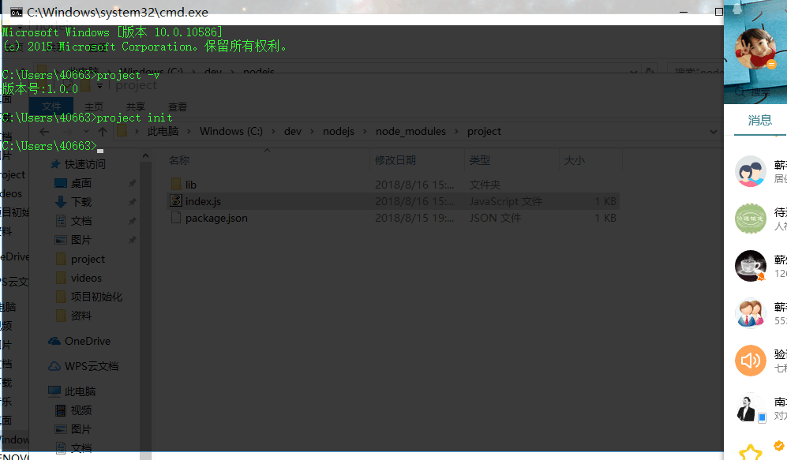
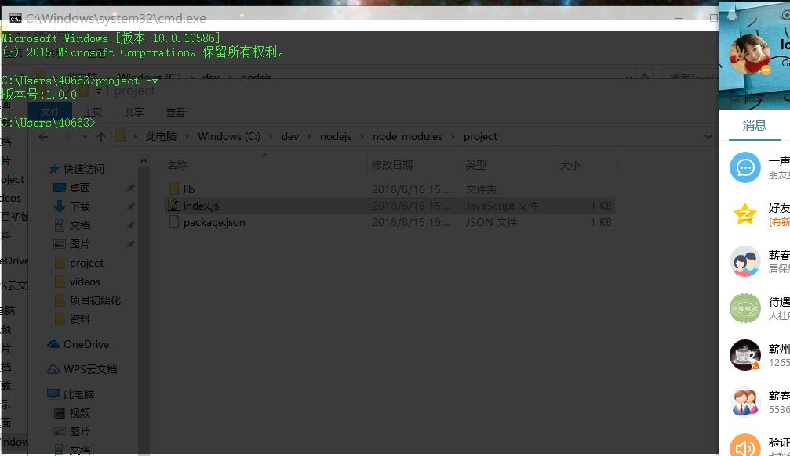

# init-project
  - 这是一个项目结构初始化管理工具，通过简单的命令，即可完成项目结构的初始化。

  - 它是基于nodeJs的,所以必须与node配合使用


### 配置
  - 将包下载后,放入node目录下node_modules目录中
  - 将 ```project.cmd``` 文件 放入 node 根目录下

  - ```注意：如果想全局使用，请配置path环境变量```


### 命令行

```  

project init  安装项目结构  

```





``` 

project init [filename]  自定义项目名 

```


``` 

project -v    查看版本号  

```





### 自定义设置

  - 此项目完全开源,如需自定义结构，请修改 ``` config 配置文件 ``` 即可:
  ```javascript
    module.exports = {

        // 根目录
        'root':'nameXi',

        // 一级目录
        'content':[
            {
                'name':'public',
                'type':'dir',
                // 当前一级目录的子目录
                'subdir':[
                    {
                        'name':'css',
                        'type':'dir'
                    },
                    {
                        'name':'js',
                        'type':'dir'
                    },
                    {
                        'name':'img',
                        'type':'dir'
                    }
                ]
            },
            
            {
                'name':'index.html',
                'type':'file'
            },
            {
                'name':'app.js',
                'type':'file'
            }
            ...
        ]
    }
```


### 默认结构

    - root
        nameXi
        - subDir
            models
            public
                - subDir
                    css
                    js
                    img
            views
            404.html
            app.js
            index.html